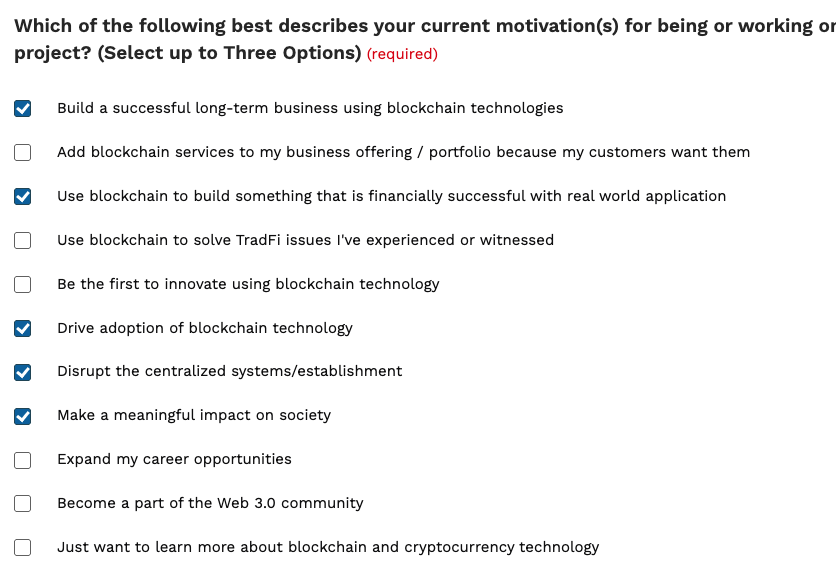

# HedgeWave Protocol
Parametric Insurance Framework

## Project and Team Information

### What is the project title?
HedgeWave Protocol

### What is the full legal name of the project lead?
Saurav Dhar

### What is the company/institution name (if applicable)?
N/A

### What is the legal entity name (if applicable)?
N/A

### Where is the majority of your team based?
US

### Who are the project team members?
**Saurav Dhar** is an Indian citizen and U.S. permanent resident based in Seattle. A software developer since 2015, he is the lead developer and founder of HedgeWave Protocol. He spent over eight years in Web2 as a fullstack engineer, including as a founding engineer at an adtech startup that was later acquired. Since late 2023, he has been building full-time in Web3, focused on Solidity and applied zero-knowledge proofs. He has won several major hackathons, including ETHDenver (2024, 2025), ETHGlobal Circuit Breaker (2024), and zkHack Istanbul and Montreal.

## Project Description and Media

### What is your project description/summary? (Limit: 100 words)

HedgeWave Protocol is a decetralized parametric insurance framework. It enables trustless insurance using smart contracts and oracles that get real world data. Payouts for real-world risks such as flight delays, bad weather, earthquakes, wildfires or inflation are triggered instantly when smart contract conditions are met based on oracle data. Users purchase coverage in RLUSD and receive compensation automatically, with no need for manual claims. Yield-seeking investors underwrite risk in exchange for returns. The framework includes vaults, oracle integration, and liquidation bots. It is open-source for developers to build new insurance verticals.

### What is your company summary? (Limit: 100 words)
N/A

### What is the link to your project demo video?
https://www.loom.com/share/7180f236165a4dfdbc817b934c1082d7

### What is the external project or company URL?
* https://hedge-wave-ripple.vercel.app/,

### What are your social media handles?
N/A

### Do you have a pitch deck to upload?
Yes (upload PDF separately)

## Development Plan and Market Fit

### In a few sentences, please summarize what you will build with XRPL Grants funding.

At ETHDenver, we built a proof of concept for a decentralized hedge against Turkish Lira inflation but had to cut corners on the protocol design to meet the hackathon deadline. With XRPL Grants funding, we’ll upgrade our smart contracts into a parametric insurance framework, with flight delay insurance as the first vertical and MVP. The system will use RLUSD for both coverage and underwriting on the XRPL EVM Sidechain, featuring vault-based capital pools, oracle integration, and liquidation bots—enabling automated, trustless payouts and real yield in RLUSD.

### What is your proposed project roadmap and key milestones (3–12 months)?

Over a 10-month period, we will take HedgeWave Protocol from a validated proof of concept to a fully functional, testnet-proven, closed-beta-ready product for decentralized flight delay insurance.

Month 1–2: Risk Vault Architecture + Protocol Refactor:
We will implement the Central Risk Vault architecture, replacing separate risk vault per market architecture with a pooled structure to improve capital efficiency and simplify investor exposure. RLUSD will be used for both underwriting and payouts.
More details here - https://github.com/enderNakamoto/xlm_evm_insure/blob/main/technical.md#central-risk-vault-architecture

Month 2–3: Oracle Infrastructure Update
We’ll deploy an Oracle Aggregator Contract and supporting off-chain ingestion scripts using Acurast TEEs or Chainlink Functions. This will modularize and decouple flight data from core contract logic for scalability.
More details gere - 

Month 4–5: Flight Delay Insurance Interface
A dedicated UI will be developed for RLUSD-based flight insurance, including real-time flight search, policy discovery, and payout transparency. It will cater to both crypto-native and mainstream users.

Month 5: Automated Market Infrastructure
We’ll integrate frontend logic that checks whether a flight is already insured, and if not, triggers creation of a new Hedge Vault on-chain. This enables just-in-time insurance for long-tail flights.
More details →

Month 6: E2E Testing + Liquidation Bots
Deploy to EVM testnet and simulate real user journeys—including purchasing RLUSD policies, oracle-based claim triggers, and investor withdrawal. We’ll also open source liquidation bots for executing payouts.
More details →

Month 7: zkTLS Flight Ticket Verification
Integrate zkTLS to verify that users actually have flight tickets, without revealing private data. We’ll work with airline and booking APIs (e.g., United, Alaska, Delta, Expedia) to verify eligibility securely.

Month 8: Closed Beta Launch + Yield Study
Launch a closed beta on the XRPL EVM Sidechain and onboard test users and RLUSD underwriters. In parallel, conduct a detailed yield analysis using live flight delay data to model capital sustainability.

Month 9-10: Auditing + Risk Mitigation
Conduct third-party audits of all smart contracts and oracle integrations. Finalize mitigation strategies for edge cases such as failed or stale oracles, and prep for public release.

### Who are your target users and what is the general market opportunity?

#### Target Users

- **Travelers (starting with crypto-native flyers):** We begin with Web3-savvy travelers attending events like ETHGlobal, Devcon, and Token2049—comfortable with stablecoins and self-custody. Over time, we’ll expand to mainstream users via airline and travel platform integrations.

- **DeFi yield seekers:** Users looking for sustainable, uncorrelated RLUSD-based returns by underwriting real-world risks like flight delays—offering an alternative to lending, LPs, or trading strategies.

- **Builders and dev teams:** Our open-source HedgeWave Protocol enables developers to build vault-based parametric insurance products for risks like wildfire, crop failure, and weather events.

- **Future users across verticals:** As we expand beyond flight delay, our user base will grow to include farmers, enterprises, and public-sector agencies seeking trustless, event-based coverage.

#### Market Opportunity 

Parametric insurance—payouts triggered by predefined data rather than claims—has grown rapidly. The global market was valued at **$16.2 billion in 2024** and is projected to reach **$40.6 billion by 2033**, growing at a **9.9% CAGR** (according to [Global Market Insights](https://www.gminsights.com/industry-analysis/parametric-insurance-market?utm_source=chatgpt.com) and [EIN Presswire](https://www.einpresswire.com/article/779961691/parametric-insurance-market-to-hit-usd-40-bn-by-2033-north-america-35-share-holding-usd-5-5-bn-revenue?utm_source=chatgpt.com)). Growth is driven by climate volatility and enabling technologies like IoT, AI, and remote sensing.

**Parametric flight delay insurance** is one of the most promising use cases. These policies issue **automatic payouts** when a flight is delayed beyond a preset threshold—typically 2 to 4 hours—using real-time data. There’s **no need for claims or receipts**; compensation is triggered instantly for the inconvenience (read more [here](https://www.ledgerinsights.com/axa-blockchain-flight-delay-compensation)).

Several players are leading this trend. **Blink Parametric** powers real-time coverage for global insurers like Manulife and Zurich (see [Blink’s ranking](https://insurtechdigital.com/top10/top-10-parametric-insurance-innovations)). **Cover Genius’s Delay Valet** enables embedded payouts like cash, credits, or vouchers for delayed flights (details [here](https://covergenius.com/delay-valet)). **Koala**, a European insurtech, offers disruption coverage across platforms like Kayak, with instant payouts and strong uptake among leisure travelers ([Koala’s growth](https://insurtechdigital.com/articles/travel-insurtech-koala-secures-funding-to-grow-in-europe)).

Blockchain further enhances parametric insurance. Smart contracts automate payouts without adjusters. Oracle networks like **Chainlink** deliver verifiable flight data to smart contracts, ensuring trust and accuracy (read more [here](https://chain.link/use-cases/insurance)). DeFi-backed insurers like **Ensuro** allow crypto investors to underwrite parametric policies, earning yield while providing liquidity on-chain.

The **travel insurance market** is projected to reach **$143.5B by 2033**, growing at **20.1% CAGR** (according to [Allied Market Research](https://www.alliedmarketresearch.com/travel-insurance-market?utm_source=chatgpt.com)). If even 10% of global policies embed parametric delay features, this could represent a **$3B+ opportunity**—making blockchain-native solutions both impactful and commercially viable.

[Market Study Details](https://github.com/enderNakamoto/ripple_evm_insurance/blob/main/market.md)

### Does your project have a GitHub repository?
Yes – https://github.com/enderNakamoto/hedgr

### Is your project already integrated with the XRP Ledger?
No 

### How will your project integrate with the XRP Ledger?

We are building on the XRPL EVM Sidechain, not the XRP Ledger itself. HedgeWave Protocol will be deployed on this EVM environment, using RLUSD as the native currency for purchasing insurance, underwriting risk, and processing payout

### What chains or sidechains are you currently building on?

We initially deployed on Sepolia testnet during the hackathon because it was the only network with a working RLUSD faucet. We'll continue prototyping on Sepolia, but we're open to deploying on any EVM-compatible chain with sufficient RLUSD liquidity—prioritizing the XRPL EVM Sidechain for mainnet launch.

## Traction and Monetization

### What is your current project traction and growth? (Include stats and metrics)

HedgeWave Protocol was created just one month ago as a hackathon project at **ETHDenver 2025**. At this early stage, we have **no active users**, **no transaction volume**, and **no wallet metrics**, as we are still in the transition from prototype to product.

**Current Traction**  
- Deployed an initial prototype on **Sepolia testnet** (due to available RLUSD faucet)  
- Received **strong validation** from Ripple mentors and ETHDenver hackathon judges  
- Conducted **user interviews** with crypto-native travelers and DeFi-native investors  
- Identified **Flight Delay Insurance** as the first high-impact vertical  
- User feedback confirmed clear **pain points** that our protocol can solve through automation and oracle-driven claims  
- Validated strong interest in earning **real yield in RLUSD** by underwriting real-world risks—yield that is uncorrelated with crypto or equity markets  
- Confirmed broader demand for **trustless parametric insurance**, especially in areas where traditional insurance is retreating

We are now ready to build on this early momentum and launch HedgeWave Protocol on the **XRPL EVM Sidechain**.

### What is your current financial runway?

We currently do not have any financial runway. We have not raised external funding or received any grants yet. This application represents the beginning of our journey, and we are applying to XRPL Grants to build something valuable with real-world impact.

### What is your monetization strategy?

Our current strategy is to take a small commission fee of 1–2% from insurance purchases and vault yields. In the future, we aim to support multiple insurance verticals by routing capital through our vault infrastructure, generating revenue as more users buy coverage and underwriters participate across different risk markets

## Categorization
### What is your main project category?
DeFi

### What is your secondary project category? (if applicable)
Real-World Assets / Insurance

### What is your project type? (Select all that apply)
* ✅ Apps and services

### Will your project utilize the EVM Sidechain?
Yes

### What is your EVM Sidechain use case?

Our use case is a parametric insurance framework built with EVM smart contracts. It will be deployed on the XRPL EVM Sidechain and use RLUSD as the stablecoin for both purchasing insurance and underwriting risk. RLUSD, as an ERC-20 standard token, is easy to integrate into our vault-based architecture and supports seamless interactions across all protocol components. Insurance buyers pay in RLUSD, and DeFi users earn real yield in RLUSD by acting as counterparties to real-world risks like flight delays.

### Is your project open source?
Yes

### What is your project stage?
Prototype: Earliest stage of startup development, building proof-of-concept or MVP to test product-market fit, still figuring out business model, may not have revenue yet 

## Motivation and Recommendations
### Which of the following best describes your current motivations for working on this project? (Select up to 3)

### Were you recommended to apply to XRPL Grants? If so, by whom?
Yes, we were encouraged to apply by Ripple mentors and judges during the ETHDenver 2025 hackathon. We received positive feedback on our project, and I’ve been in touch with **@tootypang** on Telegram, who served as a Ripple mentor at the event.

### Has any member of your team previously received funding from XRPL Grants or Ripple-affiliated programs?
No

### Was this project part of a recent XRPL Hackathon?

Yes, we participated in the ETHDenver 2025 hackathon, where Ripple sponsored a bounty. Our project was built as part of that bounty track.

### If yes, what were the hackathon name, dates, funding amounts, and project details?

- **Hackathon Name**: ETHDenver 2025  
- **Dates**: February 23 – March 1, 2025  
- **Project Name**: *HedgeWave Protocol* (initially submitted as **HedgeWave**)  
- **Bounty**: 🥇 1st Place in Ripple’s bounty — **"RLUSD: Mission Stablecoin Adoption"** - 5000 usd

**Project Links**  
- 🔗 [Devfolio Project Page](https://devfolio.co/projects/hedgewave-d63e)  
- 💻 [GitHub Repository](https://github.com/enderNakamoto/hedgr)  
- 🌐 [Live UI Demo](https://hedge-wave-ripple.vercel.app/)

**Project Summary**  
We introduced a vault-based parametric insurance protocol using RLUSD for both insurance purchases and risk underwriting. The hackathon prototype served as the foundation for what is now *HedgeWave Protocol*, focused on building real-world impact and real yield on the XRPL EVM Sidechain.

## Awareness and Consent
### How did you find out about XRPL Grants?
Hackathon

### Please provide any additional details on how you found the XRPL Grants program.
We first came across XRPL Grants while researching the Ripple bounty at ETHDenver 2025. During the event, we spoke with Ripple engineers and mentors, who explained the grant follow-up process and encouraged us to apply after the hackathon.

### Do you confirm that all provided information is accurate and complete?
Yes

### Do you agree to be contacted by XRPL Grants via email?
Yes