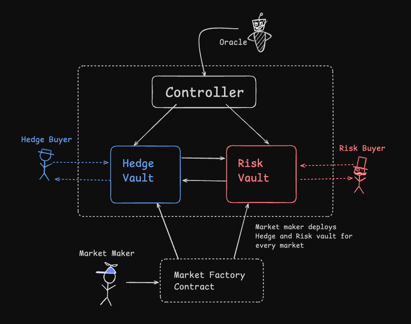
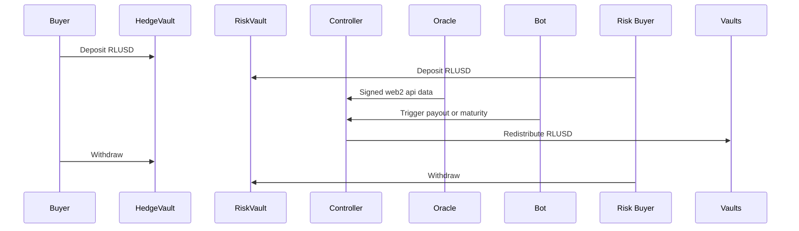
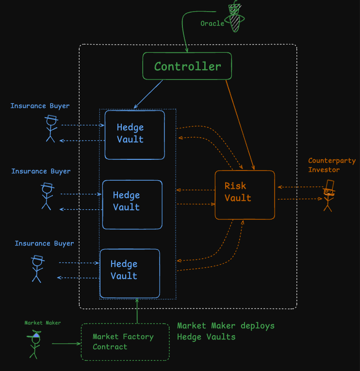
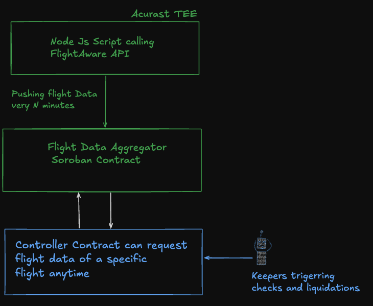

# HedgeWave Protocol — Technical Architecture

## Table of Contents

- [Overview](#overview)
- [Current Implementation](#current-implementation)
  - [Vault Architecture & and Hedge/Risk Market Design](#vault-architecture--and-hedgerisk-market-design)
  - [Oracle Integration (via Acurast TEEs)](#oracle-integration-via-acurast-tees)
  - [Insurance Flow: Use Case Example](#insurance-flow-use-case-example)
  - [Contract Interaction Diagram](#contract-interaction-diagram)
  - [Protocol Roles](#protocol-roles)
  - [Manual Market Deployment (Initial POC)](#manual-market-deployment-initial-poc)
- [Planned Development](#planned-development)
  - [Limitations of the Initial Architecture](#limitations-of-the-initial-architecture)
  - [Central Risk Vault Architecture](#central-risk-vault-architecture)
  - [Oracle Layer Enhancements](#oracle-layer-enhancements)
  - [Automated Market Creation](#automated-market-creation)
  - [Decentralized Liquidation Bots](#-decentralized-liquidation-bots)

## Overview

HedgeWave Protocol enables decentralized parametric insurance through modular smart contracts, automated vault logic, and off-chain oracle integration. The protocol allows users to hedge against real-world risks (like flight delays) or underwrite those risks in exchange for yield.

We’ve structured this technical architecture document into two parts:

- **Current Implementation** – what we’ve already built and validated on Ethereum Sepolia using RLUSD and ERC-4626 vaults  
- **Future Development** – planned upgrades to improve scalability, capital efficiency, automation, and oracle flexibility

Feel free to jump to the sections that interest you most.

## Current Implementation

### Vault Architecture & and Hedge/Risk Market Design

HedgeWave Protocol uses **OpenZeppelin’s ERC-4626** implementation to manage vaults for decentralized risk markets.

Each insurance market is structured as a pair of RLUSD-denominated vaults:

- **Hedge Vaults** for users seeking protection from specific events (e.g., flight delays)
- **Risk Vaults** for investors underwriting those risks in exchange for yield

Deposits are tracked via share balances, and outcomes are determined by oracle-triggered conditions. A **Controller Contract** oversees both vaults, handling:

- Validation of signed oracle data
- Liquidation flows (payouts to hedge buyers if the event occurs)
- Maturity logic (returning funds to risk investors if the event does not occur)

This structure enables permissionless, automated risk markets with verifiable outcomes.

Got it! Here's the revised version with the **flight delay POC removed** and both sections intact under their original headings, preserving structure and clarity:

---

### Oracle Integration (via Acurast TEEs)

HedgeWave Protocol integrates **Acurast Trusted Execution Environments (TEEs)** to securely fetch off-chain data and relay it to EVM smart contracts:

- A **Node.js script** runs in a TEE and fetches external data (e.g., flight status, FX rates)
- The script signs data, and only messages from whitelisted oracle addresses are accepted on-chain

This enables trust-minimized insurance resolution without relying on centralized infrastructure.

### Insurance Flow: Use Case Example

One of the early demonstrations involved tracking the **Turkish Lira's price** using a Forex API.  

1. Users deposited RLUSD into Hedge or Risk Vaults  
2. Acurast Oracle monitored the Lira’s price performance  
3. If the Lira dropped more than 10% within a month (before market maturity):  
   - The Risk Vault was liquidated  
   - Capital flowed to the Hedge Vault (payout to the hedger)  
4. If no drop occurred:  
   - Hedge Vault matured and capital flowed to the Risk Vault  
5. Users withdrew based on the outcome  

This proof of concept case confirmed that decentralized, event-driven insurance can be executed reliably using oracles and programmable vault logic on EVM.
[Github Link to POC](https://github.com/enderNakamoto/hedgr)

### Contract Interaction Diagram

### Protocol Roles

#### 1. Hedge Buyers  
Deposit into Hedge Vaults to protect against risk. Receive payouts if event occurs.

#### 2. Risk Investors  
Deposit into Risk Vaults to underwrite coverage. Earn yield if no claim occurs.

#### 3. Liquidators / Keepers  
Automated agents that trigger smart contract actions based on oracle data.

#### 4. Market Creators  
Deploy new risk markets using the Factory Contract. Define terms and target events.

### Manual Market Deployment (Initial POC)

For the initial proof of concept, we manually deployed **Hedge and Risk Vaults** for a single **forex-based insurance market**—specifically tracking **Turkish Lira (TRY) against USD**.

- The **oracle script** running inside the Acurast TEE was hardcoded to fetch data for that one pair
- The **Vault Factory** was not yet implemented, so markets were deployed manually
- The **HedgeWave team** acted as the market maker, handling vault setup and configuration

While not scalable, this approach allowed us to validate the idea.

## Planned Development

### Limitations of the Initial Architecture

Our early implementation focused on isolated markets with binary outcomes to validate the core mechanics—vault deposits, oracle-triggered payouts, and liquidation logic. While this structure proved that decentralized, on-chain insurance is viable, it also surfaced key limitations that need to be addressed before scaling to a production-ready platform.

**Capital Fragmentation**  
Each market required its own dedicated Risk Vault, forcing investors to lock funds into individual scenarios (e.g., one forex pair or inflation metric). This led to inefficient capital use and limited diversification.

**All-or-Nothing Liquidation**  
If the predefined condition (e.g., 10% currency drop) was met, the entire Risk Vault was liquidated. While simple, this binary logic doesn’t reflect real-world insurance behavior, which often involves **partial** or **capped** payouts.

As a result, the system functioned more like a prediction or betting market than a robust parametric insurance framework.

To evolve the architecture into a scalable, production-grade protocol, we are now focusing on three key upgrades:

- **Central Risk Vault Architecture**  
- **Oracle Layer Enhancements**  
- **Automated Market Creation**

Let’s explore each of these in detail.

### Central Risk Vault Architecture
To address capital fragmentation and enable more scalable insurance logic, we are transitioning to a **Central Risk Vault Architecture**. Unlike the original 1:1 market structure—where each market required its own pair of Hedge and Risk Vaults—this upgraded design introduces a single, unified **Risk Vault** that services multiple Hedge Vaults.

Each new insurance market now only deploys a **Hedge Vault**, significantly reducing deployment overhead and simplifying capital flow. Risk investors deposit once into the central Risk Vault and gain diversified exposure across all active markets without needing to manage each individually.

To make risk exposure predictable and safe for investors, the architecture supports **capped payouts**. Each Hedge Vault defines a maximum disbursement limit per claim. For example, a $10 premium might entitle the buyer to a $100 capped payout, regardless of the severity of the triggering event.

This structure improves capital efficiency, simplifies the investor experience, and brings the architecture closer to traditional pooled insurance models—while maintaining the transparency and automation benefits of smart contracts.

### 🛰️ Oracle Layer Enhancements

While our initial proof of concept focused on hedging against inflation via forex markets (TRY/USD), we’re now transitioning our first production vertical to flight delay insurance.

In our original implementation, oracle data was sent directly to the Controller Contract. While simple, this approach limited scalability and made data access tightly coupled to specific contract interactions.

To address this, we’re introducing a more modular and scalable **oracle pipeline**, inspired by Chainlink’s price feed architecture. As shown in the diagram, we’ve inserted a **Flight Data Aggregator Contract** between the oracle data source and the controller logic.

- A **Node.js script running inside Acurast TEE** fetches flight data from the FlightAware API and pushes updates every N minutes to the aggregator contract on Soroban.
- This contract stores the latest status for all tracked flights and acts as the canonical source of truth for downstream contracts.
- The **HedgeWave Controller Contract** can then request data for any specific flight as needed, triggered by keepers or liquidation bots.
- This allows HedgeWave markets to query flight status asynchronously, enabling better performance, reduced gas usage, and cleaner separation of concerns.

By decoupling data ingestion from insurance contract logic, we create a reusable oracle layer. As long as a flight’s data is being actively aggregated, a new parametric insurance market can be launched on top of it without requiring changes to the data pipeline.

This design supports broader scalability, simplifies deployment of new markets, and sets the stage for supporting other data types beyond flight delays.

### Automated Market Creation

To enable scalable, on-demand insurance markets, we’re introducing **automated market creation**. When a user initiates coverage for a specific flight, the protocol first checks if that flight is already tracked by the **Flight Data Aggregator**. If the data exists, the system automatically:

- Deploys a new **Hedge Vault** linked to that flight
- Registers the vault and associated market metadata with the **Controller Contract**
- Connects the vault to the shared **Central Risk Vault**

This approach allows a single Controller Contract to manage multiple active insurance markets in parallel. Each market is tied to its own Hedge Vault, but all share the same core logic, oracle interface, and payout mechanism—ensuring consistent execution and clean separation of capital.

This automation unlocks:
- Long-tail coverage with minimal manual setup
- Dynamic market spin-up based on user demand
- Simplified onboarding for new insurance buyers

Here’s a focused rewrite of that section, specifically about **decentralized liquidation bots**, trimmed for clarity and relevance:

---

### Decentralized Liquidation Bots

To enforce insurance logic on-chain, HedgeWave Protocol relies on **Liquidation Bots**—automation agents that monitor oracle data and trigger transactions when conditions are met (e.g., price drop, flight delay).

Our initial setup used centralized cron jobs and Node.js scripts to test end-to-end flows, including oracle verification and payout execution.

As we move forward, we're transitioning to a fully decentralized liquidation system:

- **Open-source bots** that anyone can run  
- **On-chain incentives** for timely execution of valid transactions  
- **Clear documentation** to support community operators

This decentralized automation layer ensures that insurance markets remain trustless, efficient, and resilient without relying on internal infrastructure.